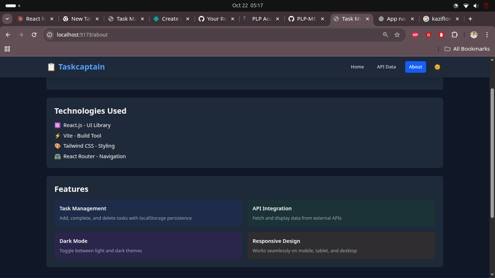
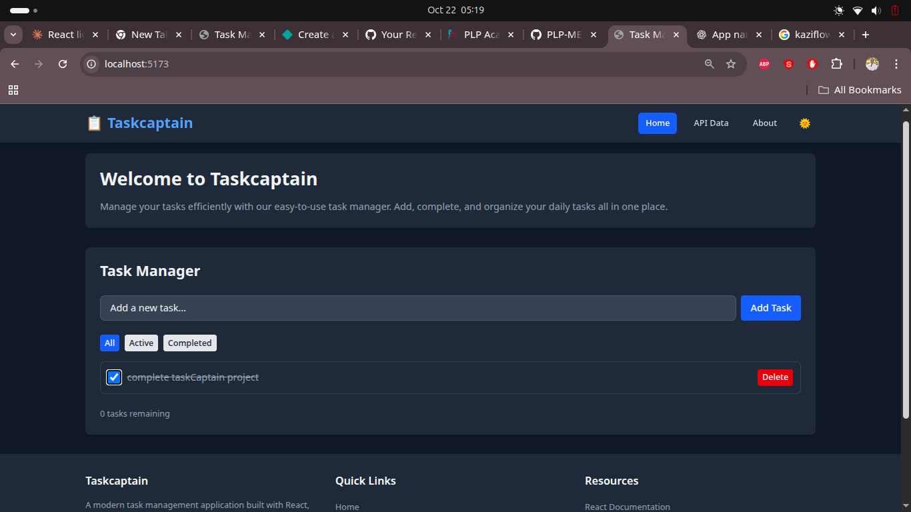
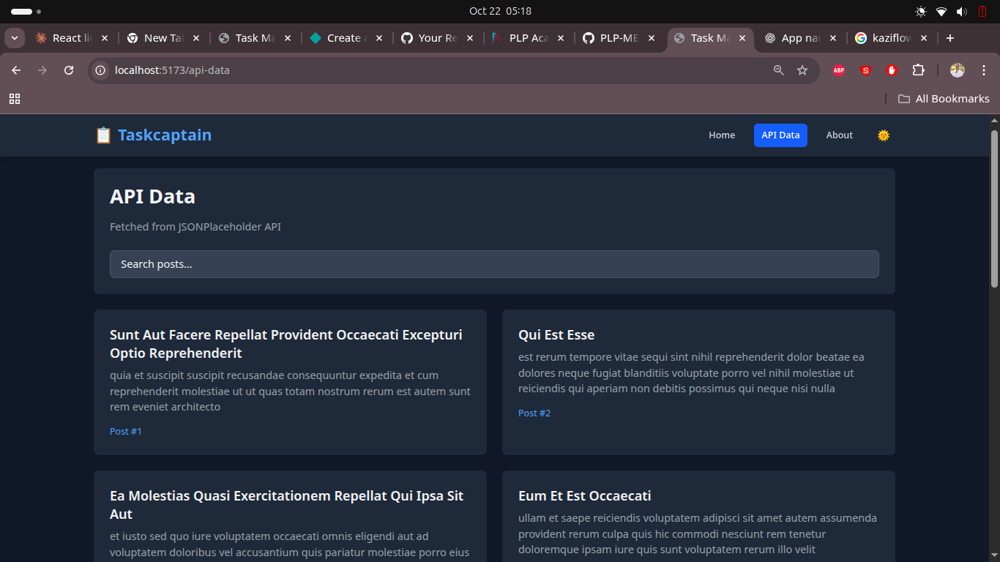

# 📋 Taskcaptain

A modern, responsive task management application built with React, Vite, and Tailwind CSS. This project demonstrates advanced front-end development practices including component architecture, state management, API integration, and theme customization.

![home page] (image-10.png)
![api data page] (image-6.png)


## 🌟 Features

### Core Functionality
- ✅ **Task Management**: Create, complete, and delete tasks with ease
- 💾 **Local Storage Persistence**: Tasks are automatically saved to browser storage
- 🔍 **Task Filtering**: Filter tasks by all, active, or completed status
- 📊 **Task Statistics**: Real-time count of remaining tasks

### User Experience
- 🌓 **Dark Mode**: Toggle between light and dark themes with persistence
- 📱 **Responsive Design**: Seamless experience across mobile, tablet, and desktop
- 🎨 **Modern UI**: Clean, intuitive interface with smooth transitions
- ⚡ **Fast Performance**: Lightning-fast load times with Vite

### API Integration
- 🌐 **External API Data**: Fetch and display data from JSONPlaceholder API
- 🔄 **Loading States**: Visual feedback during data fetching
- ❌ **Error Handling**: Graceful error messages with retry options
- 📄 **Pagination**: Navigate through large datasets efficiently
- 🔎 **Search Functionality**: Filter API results in real-time

## 🚀 Getting Started

### Prerequisites

Before you begin, ensure you have the following installed:
- **Node.js** (v20.19.0 or higher)
- **npm** (v8.0.0 or higher)

### Installation

1. **Clone the repository**
   ```bash
   git clone https://github.com/yourusername/plp-task-manager.git
   cd plp-task-manager
   ```

2. **Install dependencies**
   ```bash
   npm install
   ```

3. **Start the development server**
   ```bash
   npm run dev
   ```

4. **Open your browser**
   
   Navigate to `http://localhost:5173` (or the port shown in your terminal)

### Build for Production

```bash
npm run build
```

The optimized production build will be in the `dist/` folder.

### Preview Production Build

```bash
npm run preview
```

## 🏗️ Project Structure

```
plp-task-manager/
├── public/               # Static assets
├── src/
│   ├── assets/          # Images, SVGs, and other assets
│   ├── components/      # Reusable React components
│   │   ├── Button.jsx
│   │   ├── Footer.jsx
│   │   ├── Layout.jsx
│   │   ├── Navbar.jsx
│   │   └── TaskManager.jsx
│   ├── context/         # React Context for state management
│   │   └── ThemeContext.jsx
│   ├── pages/           # Page components
│   │   ├── About.jsx
│   │   ├── ApiData.jsx
│   │   └── Home.jsx
│   ├── App.jsx          # Main application component
│   ├── main.jsx         # Application entry point
│   └── index.css        # Global styles
├── index.html
├── package.json
├── tailwind.config.js   # Tailwind CSS configuration
├── vite.config.js       # Vite configuration
└── README.md
```

## 🛠️ Technologies Used

### Core Technologies
- **[React 19.2.0](https://react.dev/)** - UI library for building component-based interfaces
- **[Vite 7.1.7](https://vitejs.dev/)** - Next-generation frontend build tool
- **[Tailwind CSS 4.1.15](https://tailwindcss.com/)** - Utility-first CSS framework

### Routing & Navigation
- **[React Router DOM 7.9.4](https://reactrouter.com/)** - Declarative routing for React applications

### Development Tools
- **[ESLint](https://eslint.org/)** - Code linting and quality assurance
- **[PropTypes](https://www.npmjs.com/package/prop-types)** - Runtime type checking for React props

## 📚 Key Concepts Demonstrated

### 1. Component Architecture
- **Reusable Components**: Button component with multiple variants (primary, secondary, danger)
- **Layout Components**: Consistent page structure with Navbar and Footer
- **Composition**: Building complex UIs from simple, focused components

### 2. State Management
- **React Hooks**: `useState`, `useEffect` for component state
- **Custom Hooks**: `useLocalStorageTasks` for persistent task management
- **Context API**: Global theme state with `ThemeContext`

### 3. API Integration
- **Async/Await**: Modern asynchronous JavaScript
- **Error Handling**: Try-catch blocks with user-friendly error messages
- **Loading States**: Skeleton loaders and spinners for better UX

### 4. Styling & Design
- **Tailwind CSS**: Utility-first approach for rapid UI development
- **Dark Mode**: Class-based dark mode with Tailwind
- **Responsive Design**: Mobile-first approach using Tailwind breakpoints

## 🎯 Features Walkthrough

### Task Manager
The Task Manager component demonstrates:
- Form handling and validation
- Local storage integration
- Array manipulation (add, update, delete)
- Conditional rendering
- Filter logic implementation

### API Data Page
The API integration showcases:
- Fetching data from external APIs
- Loading and error states
- Search/filter functionality
- Pagination implementation
- Responsive grid layouts

### Theme System
The theme context provides:
- Global state management
- Persistent user preferences
- Dynamic class toggling
- Smooth transitions between themes

## 🧪 Available Scripts

| Command | Description |
|---------|-------------|
| `npm run dev` | Start development server |
| `npm run build` | Build for production |
| `npm run preview` | Preview production build |
| `npm run lint` | Run ESLint for code quality |

## 🌐 Deployment

### Deploy to Vercel

1. Install Vercel CLI
   ```bash
   npm i -g vercel
   ```

2. Deploy
   ```bash
   vercel
   ```

### Deploy to Netlify

1. Build the project
   ```bash
   npm run build
   ```

2. Deploy the `dist` folder to Netlify

### Deploy to GitHub Pages

1. Install gh-pages
   ```bash
   npm install --save-dev gh-pages
   ```

2. Add to package.json scripts:
   ```json
   "homepage": "https://yourusername.github.io/plp-task-manager",
   "predeploy": "npm run build",
   "deploy": "gh-pages -d dist"
   ```

3. Deploy
   ```bash
   npm run deploy
   ```

## 📖 Learning Resources

This project was built as part of the PLP MERN Stack program. Here are some helpful resources:

- [React Documentation](https://react.dev/)
- [Vite Guide](https://vitejs.dev/guide/)
- [Tailwind CSS Documentation](https://tailwindcss.com/docs)
- [React Router Tutorial](https://reactrouter.com/en/main/start/tutorial)
- [MDN Web Docs](https://developer.mozilla.org/)

## 🤝 Contributing

Contributions are welcome! Here's how you can help:

1. Fork the repository
2. Create a feature branch (`git checkout -b feature/AmazingFeature`)
3. Commit your changes (`git commit -m 'Add some AmazingFeature'`)
4. Push to the branch (`git push origin feature/AmazingFeature`)
5. Open a Pull Request

## 📝 License

This project is licensed under the MIT License - see the LICENSE file for details.

## 👨‍💻 Author

**Philip Ondieki**

- GitHub: [@philipondieki](https://github.com/philipondieki)
- Project: [Taskcaptain](https://github.com/philipondieki/plp-task-manager)

## 🙏 Acknowledgments

- Power Learn Project (PLP) for the MERN Stack program
- JSONPlaceholder for the free API
- The React and Tailwind CSS communities for excellent documentation

## 📸 Screenshots

### Light Mode
![Light Mode Home] 

### Dark Mode


### API Data Page


---

**Built with ❤️ for learning and growth**

*If you found this project helpful, please consider giving it a ⭐ on GitHub!*